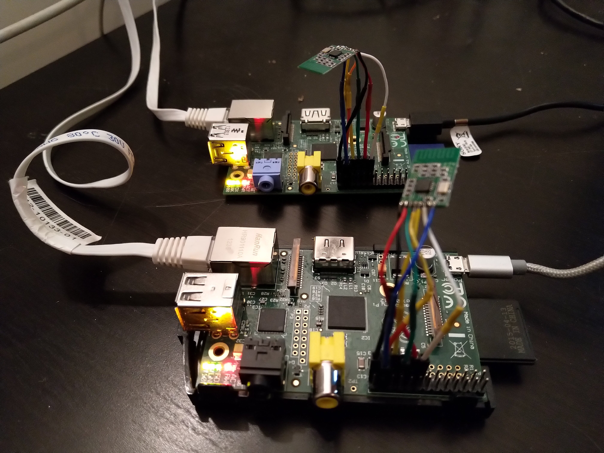

# Raspberry Pi CC2500 Transceiver Example

An example transmitter and receiver for CC2500 RF module for Raspberry Pi written in C.

# Requirements

* Two Raspberry Pi single-board computers
* Two CC2500 modules

Tested with:
* Raspberry Pi Model B Rev 2
* [CC2500 Wireless Module 2.4G Small Volume Low Power Consumption](https://www.aliexpress.com/item/CC2500-Wireless-Module-2-4G-Small-Volume-Low-Power-Consumption/32465792453.html)



# Setup

## Install dependencies

```
sudo apt install git cmake wiringpi
```


## Set up SPI bus on Raspberry Pi

```
sudo raspi-config
```

Select:

* 5.Interfacing Options
* P4 SPI
* YES
* OK
* Finish

## Build software
```
git clone https://github.com/alexbirkett/cc2500-raspberry-pi.git
cd cc2500-raspberry-pi
mkdir build
cd build
cmake ..
make
```

## Connect module

| Raspberry Pi Physical Pin	| Name  	                  | CC2500 PIN 	|
|---	                      |---	                      |---	        |
|   15	                    |  BCM 22 / WiringPi pin 3 	|   GDO2	    |
|   17                      |  3v3 Power	              |   3.3V	    |
|   19                      |  SPI0 MOSI 	              |   MOSI	    |
|   21                      |  SPI0 MISO                |   MISO      |
|   23                      |  SPI0 SCLK	              |   RFSCL     |
|   24                      |  SPI0 CE0                 |   RFCS	    |
|   25                      |  GND                      |   GND	|   	|


## Run transmitter

On the first Raspberry Pi:

From the `cc2500-raspberry-pi/build` directory:

```
./transmitter
```

## Run receiver

On the second Raspberry Pi:

From the `cc2500-raspberry-pi/build` directory:

```
./receiver
```
